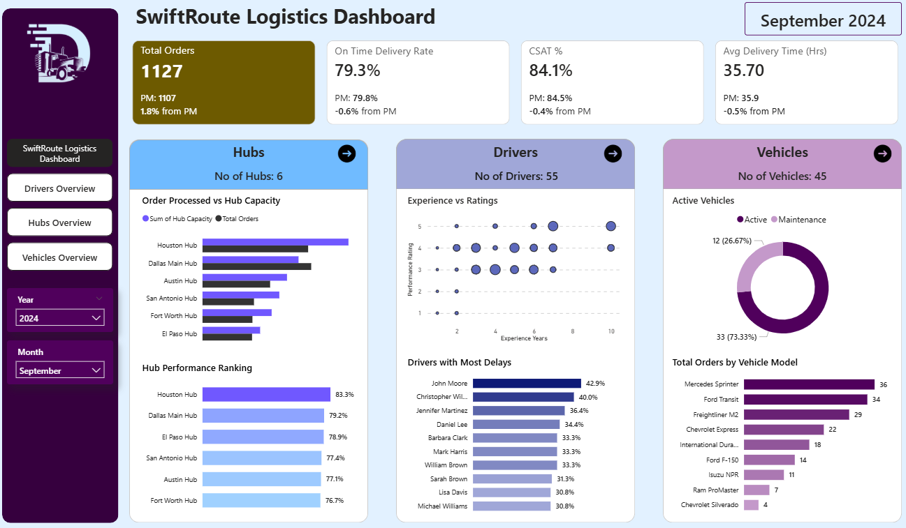
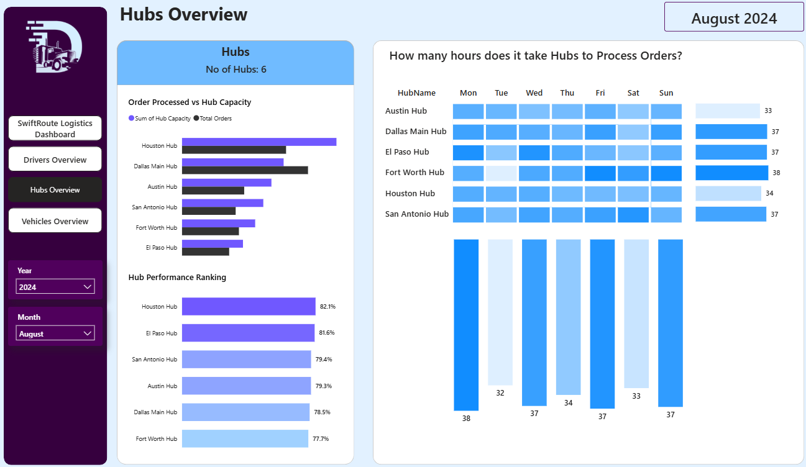
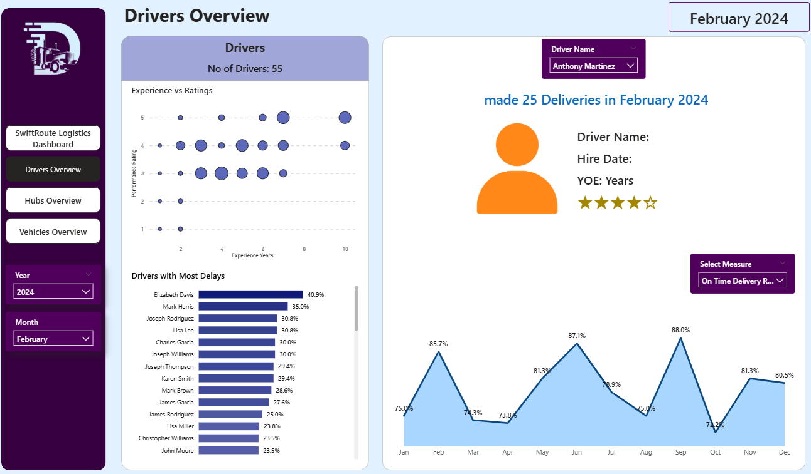
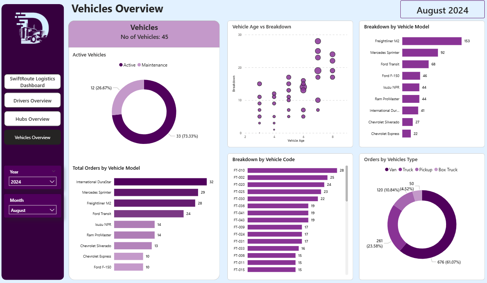
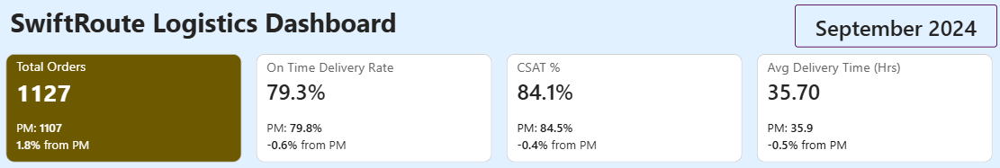

# 🚚 Logistics Dashboard (Power BI)

## 📌 Project Overview
This project presents a comprehensive Logistics Dashboard built using Power BI to monitor and analyze delivery operations across hubs, drivers, and vehicles.

The dashboard provides real-time insights into order performance, delivery efficiency, customer satisfaction, and operational bottlenecks, enabling data-driven decision-making.

---

## 🎯 Business Objective
The goal is to track and improve logistics performance by:
- Monitoring order volume and delivery efficiency  
- Analyzing hub performance and capacity utilization  
- Evaluating driver performance and delays  
- Tracking vehicle usage and maintenance issues  

---

## 🛠 Tools & Technologies
- Power BI – Data visualization and dashboard development  
- Excel/CSV – Dataset  

---

## 📊 Key Performance Indicators (KPIs)

- 📦 Total Orders  
- ⏱ On-Time Delivery Rate (%)  
- ⭐ Customer Satisfaction Score (CSAT %)  
- 🚚 Average Delivery Time (Hours)  
- 📈 Month-over-Month (MoM) Growth Metrics  

---

## 📈 Dashboard Structure

### 🔹 Dashboard 1: Overview

#### Key Metrics
- Total Orders (Current vs Previous Month)  
- On-Time Delivery Rate (MoM Change)  
- Customer Satisfaction Score (MoM Change)  
- Average Delivery Time (MoM Change)  

#### Hub Insights
- Total Number of Hubs  
- Orders Processed vs Hub Capacity  
- Hub Performance Ranking  

#### Driver Insights
- Total Drivers  
- Experience vs Rating Analysis  
- Drivers with Most Delays  

#### Vehicle Insights
- Total Vehicles  
- Active vs Inactive Vehicles  
- Orders by Vehicle Model  

---

### 🔹 Dashboard 2: Hubs Overview
- Total Hubs  
- Orders vs Capacity  
- Hub Ranking  
- Hub Processing Time (Hours)  

---

### 🔹 Dashboard 3: Drivers Overview
- Total Drivers  
- Experience vs Rating (Scatter Plot)  
- Drivers with Most Delays  
- Driver Profile Summary:
  - Hire Date  
  - Experience (YOE)  
  - Rating  
  - Monthly Deliveries  
- Monthly Order Trend  

---

### 🔹 Dashboard 4: Vehicle Overview
- Total Vehicles  
- Active Vehicles  
- Orders by Vehicle Model  
- Vehicle Age vs Breakdown  
- Breakdown by Vehicle Code  
- Breakdown by Vehicle Model  
- Orders by Vehicle Type  

---

## 📊 Visualizations Used
- KPI Cards  
- Bar Charts  
- Line Charts  
- Scatter Plots  
- Donut Charts  
- Matrix Tables  

---

## 📸 Screenshots

### 🔹 Dashboard Overview

### 🔹 Hub Analysis

### 🔹 Driver Analysis

### 🔹 Vehicle Analysis

### 🔹 KPIs

---

## 💡 Key Insights

- Certain hubs are operating above capacity, causing delays  
- A small number of drivers contribute to most delivery delays  
- Experienced drivers tend to have higher ratings and better performance  
- Older vehicles show higher breakdown frequency  
- On-time delivery rate fluctuates monthly, indicating operational inefficiencies  
- Customer satisfaction is directly linked to delivery time and delays  

---

## 🚀 Business Impact
- Improves delivery efficiency and reduces delays  
- Helps optimize hub workload distribution  
- Enables targeted driver training programs  
- Supports fleet maintenance planning  
- Enhances customer satisfaction through data-driven insights  

---

## 🔗 Future Improvements
- Add real-time data integration  
- Predict delivery delays using machine learning  
- Optimize route planning  
- Advanced driver performance scoring system  

---

## 🙌 Connect With Me
If you found this project useful, feel free to connect or give feedback!
